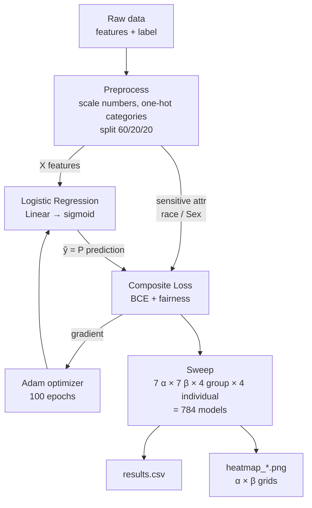

# FairML — Architecture, Flow & Glossary

A paired fairness study: train a logistic-regression classifier with a **composite
accuracy + fairness loss**, then sweep the weighting knobs and visualize the
trade-offs as heatmaps. The **exact same method** is applied to two datasets so
results are directly comparable.

| | COMPAS (`Compas.py`) | German Credit (`German.py`) |
|---|---|---|
| Predict | `two_year_recid` (1 = re-offended) | `risk` (1 = bad credit) |
| Sensitive attribute | `race` | `Sex` |
| Data source | remote ProPublica CSV | `data/german_credit_data.csv` + local `statlog+.../german.data` labels |
| Outputs | `NEW_MODEL/`, `NEW_RESULTS/` | `GERMAN_MODEL/`, `GERMAN_RESULTS/` |

Everything else — preprocessing, 60/20/20 split, model, loss, optimizer, metrics,
784-combo sweep, heatmaps — is shared.

---

## 1. High-level flow



## 2. The loss (the heart of the project)

```
total_loss = α · BCE
           + (1 − α) · [ β · GroupFairness  +  (1 − β) · IndividualFairness ]
```

```
                 accuracy  ◄──────  α  ──────►  fairness
                                                   │
                          group fairness ◄── β ──► individual fairness
```

- **α (alpha)** — how much you care about accuracy vs. fairness. α=1 → pure accuracy; α=0 → pure fairness.
- **β (beta)** — *within* the fairness half, how much is group fairness vs. individual fairness.
- The sweep tries every combination of α, β, and *which* group/individual metric to use.

## 3. File map

```
German.py / Compas.py   Orchestration: load → preprocess → sweep → plot
Models.py               LogisticRegressionModel (Linear+sigmoid), train_model, evaluate
Loss.py                 custom_loss_function = α·BCE + (1−α)(β·group + (1−β)·individual)
GroupFairness.py        demographic_parity, equalized_odds, equal_opportunity, disparate_impact
IndividualFairness.py   theil, generalized_entropy, atkinson, gini
data/                   german_credit_data.csv (features)
statlog+german+...      german.data (labels for German)
*_MODEL/                one .pth checkpoint per (α, β, group, individual) combo
*_RESULTS/              results.csv + PLOTS/heatmap_<metric>.png
```

---

## 4. Glossary

### Models & training
- **Logistic Regression** — a single linear layer (`weights·features + bias`) passed through a **sigmoid** to output a probability between 0 and 1. Used for yes/no classification. *Not* linear regression (which predicts unbounded numbers).
- **Sigmoid** — squashing function mapping any number to (0,1); the output is read as "probability of the positive class."
- **BCE (Binary Cross-Entropy)** — the standard accuracy loss for binary classification; penalizes confident wrong predictions.
- **Adam** — the gradient-descent optimizer used to update weights (lr=0.01, 100 epochs).
- **Sensitive attribute** — the protected feature fairness is measured across (`race` for COMPAS, `Sex` for German).
- **60/20/20 split** — train / validation / test partition of the data.

### Group fairness (fairness *between* demographic groups)
- **Demographic Parity Difference (DPD)** — gap in the rate of positive predictions across groups. 0 = both groups selected at the same rate.
- **Equalized Odds Difference (EOD)** — gap in *both* true-positive and false-positive rates across groups. 0 = equally accurate per group.
- **Equal Opportunity Difference** — gap in true-positive rate only (do qualified people in each group get the positive outcome equally?).
- **Disparate Impact Difference** — max−min selection rate across groups (related to the "80% rule").

### Individual fairness (inequality *across all individuals*' predictions)
- **Theil Index** — an inequality measure from economics; 0 = perfectly equal predictions.
- **Generalized Entropy Index** — family of inequality measures generalizing Theil.
- **Atkinson Index** — inequality measure with an adjustable inequality-aversion parameter.
- **Gini Coefficient** — 0 (everyone equal) to 1 (maximally unequal) spread of predictions.

### Sweep & outputs
- **α / β (alpha / beta)** — the two trade-off knobs in the loss (see §2).
- **Sweep** — training one model for every combination: 7 α × 7 β × 4 group metrics × 4 individual metrics = **784 models**.
- **Heatmap** — α (rows) × β (columns) grid colored by a metric; the project's main visualization.
- **Checkpoint (`.pth`)** — saved trained weights; a combo is skipped on re-run if its `.pth` already exists.

---

## 5. Important things you SHOULD know

1. **⚠️ Fairness terms don't actually train the model.** In `Loss.py` the fairness
   terms are computed with `.round().detach().numpy()`, which **removes them from
   autograd**. Only the BCE term produces gradients. So today the model effectively
   trains on **accuracy alone**, and the β knob does nothing during training.
   → This is *the* most important caveat. Fixing it (differentiable fairness terms)
   is what would make the whole architecture behave as intended.

2. **The heatmaps are horizontally banded because of #1.** Values change down the
   α rows but are flat across the β columns — a direct symptom of the detached
   fairness gradient, not a real fairness/accuracy trade-off.

3. **α = 0 is degenerate.** With α=0 the loss has zero gradient → the model never
   trains → it stays at random init (~0.49 accuracy, noisy fairness). Ignore that
   top row as "untrained," not as a result.

4. **Accuracy ≈ base rate.** Trained models sit at ~0.71 (German) — roughly the
   majority-class rate (700 good / 300 bad). "Good" group-fairness numbers (DPD≈0.01)
   partly reflect a near-constant classifier, not learned fairness.

5. **Two datasets, one method.** Any change to the model, loss, or sweep must be
   mirrored in **both** `Compas.py` and `German.py`; only target, sensitive
   attribute, data source, and output dirs should differ.

6. **Re-run caching.** Training is skipped when a combo's `.pth` exists, and
   `results.csv` is not regenerated if present. To force a clean run:
   `rm -rf GERMAN_MODEL GERMAN_RESULTS && python German.py`.

7. **Dead/unused code.** `EarlyStopping.py` is never imported; `average_odds_difference`
   in `GroupFairness.py` is defined but unused.
```
