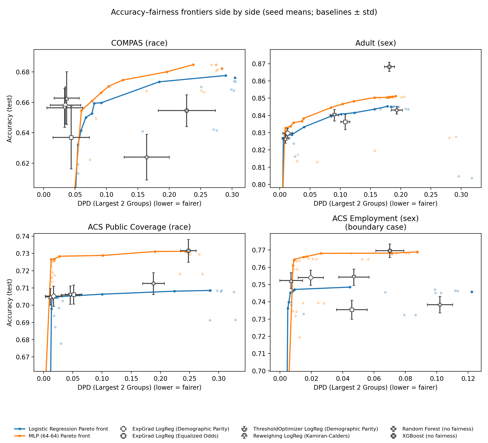
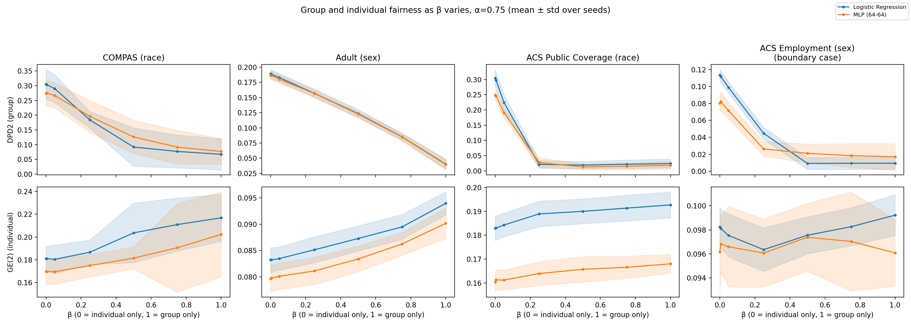
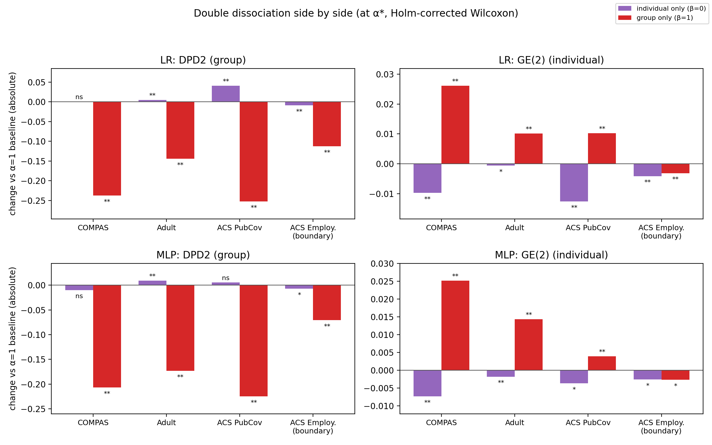
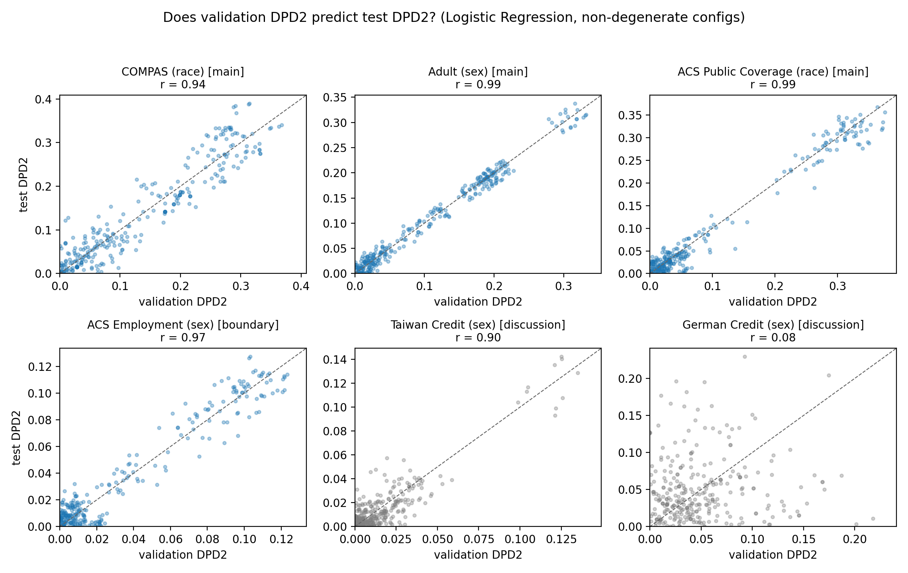

# FairML — Cross-Dataset Report

**Question:** can one loss knob (β) trade group fairness against individual fairness, and does it work across datasets?

- **Loss:** α·BCE + (1−α)·[β·group term + (1−β)·individual term]
- **Metrics:** **DPD2** = group fairness (gap in positive-prediction rate between the two groups; lower is fairer). **GE(2)** = individual fairness (lower is fairer).
- **Setup:** logistic regression (LR) and MLP, 10 seeds each.

| Dataset | Role | n | Groups | Label gap |
|---|---|---|---|---|
| COMPAS | main | 6,172 | African-American vs Caucasian | 13.2 pts |
| Adult | main | 45,222 | male vs female | 19.9 pts |
| ACS Public Coverage | main | 50,000 | White vs Black | 16.4 pts |
| ACS Employment | boundary case | 50,000 | male vs female | 9.7 pts |
| Taiwan Credit | discussion | 30,000 | male vs female | 3.4 pts |
| German Credit | discussion | 1,000 | male vs female | 7.5 pts |

---

## 1. The fair model cuts disparity at a small accuracy cost

Each line shows the best accuracy reachable at each level of disparity. The markers are standard fairness methods (ExpGrad, ThresholdOptimizer, Reweighing) and unconstrained models (Random Forest, XGBoost).

| Dataset | DPD2 before → after (LR) | Accuracy cost |
|---|---|---|
| COMPAS | 0.30 → 0.06 (−80%) | 1.5 pts |
| Adult | 0.18 → 0.02 (−89%) | 1.5 pts |
| ACS Public Coverage | 0.29 → 0.02 (−93%) | 0.4 pts |
| ACS Employment | 0.12 → 0.01 (−92%) | none |

All four reductions are significant (p < 0.01). The fair models are competitive with the standard fairness methods.

## 2. The core finding: group and individual fairness pull apart

Moving β from 0 (individual only) to 1 (group only):

- **COMPAS, Adult, ACS Public Coverage:** DPD2 falls (top row) while GE(2) rises (bottom row). Improving group fairness costs individual fairness.
- **ACS Employment:** DPD2 falls but GE(2) stays flat, so there's no trade-off here.

## 3. Each objective helps only its own metric

Change from the unconstrained model when all fairness weight goes to one term:

- **Group only (red):** big DPD2 drop, but GE(2) gets *worse*.
- **Individual only (purple):** GE(2) improves, but DPD2 does not (on ACS Public Coverage LR it gets worse: 0.29 → 0.33).
- **ACS Employment is the exception:** both objectives improve both metrics. **The trade-off is common but not universal.**

## 4. Why German fails and Taiwan doesn't (discussion)

The fair model is picked on a validation split. That only works if validation disparity predicts test disparity (points on the dashed line).

- **Every dataset except German:** r ≥ 0.90, so selection works.
- **German (n=1,000):** r = 0.08. The validation split has only about 60 women, too few to measure disparity, so selection is effectively random.
- **Taiwan** has small disparity like German but 30× the data, and selection still works (r = 0.90). German's null result is caused by **sample size**, not by the method.

---

**Takeaway:** a single β knob moves a model along a real group-vs-individual fairness trade-off on three datasets. The trade-off vanishes on one (ACS Employment). Tuning fails when data is too small to measure disparity (German).

*Regenerate:* `.venv/bin/python new_experiment/analysis/run_analysis.py --dataset all` (figures are rewritten into `reports/fig/`). Full tables: `new_experiment/RESULTS/paper/cross_dataset/`.
